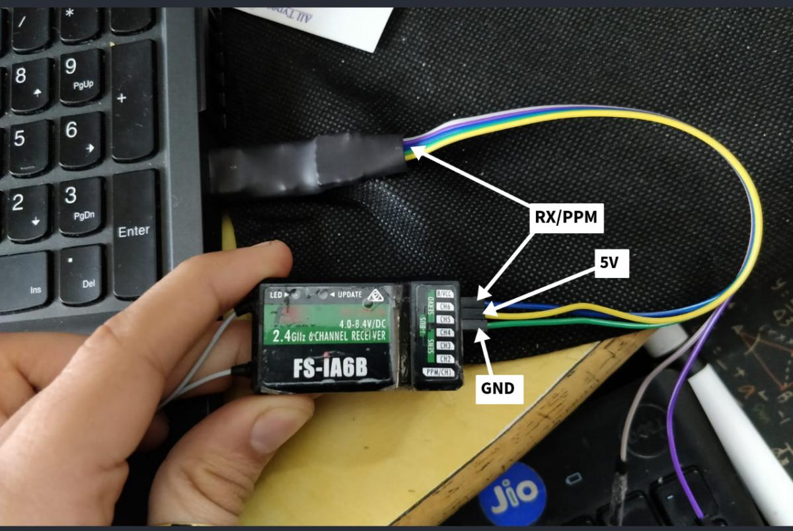

# joystick to UDP

A minimal C++ object-oriented API onto joystick devices under Linux. This fork is aimed at sending joystick commands as RC values (1000-2000) over UDP to a flight controller. In this case it was used to fly a drone on [AirSim](https://github.com/microsoft/AirSim) with [betaflight](https://github.com/betaflight/betaflight) as the firmware.

## Build 
```
g++ joystick_to_socket.cpp joystick.cc -o joy2sock
```
## Run
This was tested on ubuntu 20.04, rx:FS-IA6B, tx:FS-I6 but should be easy enough to extrapolate:

1. Connect the receiver using a USB to TTL cable as shown below  and bind it to the transmitter:


2. Run these commands to recognise the joystick as input device:
```
sudo modprobe serio
sudo inputattach --fsia6b /dev/ttyUSB0 &
```
You might need to identify your axes and figure out the attached device name (/dev/input/jsx) using `jstest-gtk`.
[Thank you for 1,2](https://olayasturias.github.io/flysky/fs-i6x/phdstuff/2020/07/21/flysky-linux.html)

3. Run joy2sock `./joy2sock`


## Orginal repo API

Create an instance of `Joystick`:

```c++
Joystick joystick;
```

Ensure that it was found and that we can use it:

```c++
if (!joystick.isFound())
{
  printf("open failed.\n");
  // hmm
}
```

Sample events from the `Joystick`:

```c++
JoystickEvent event;
if (joystick.sample(&event))
{
  // use 'event'
}
```

## example

You might run this in a loop:

```c++
while (true)
{
  // Restrict rate
  usleep(1000);

  // Attempt to sample an event from the joystick
  JoystickEvent event;
  if (joystick.sample(&event))
  {
    if (event.isButton())
    {
      printf("Button %u is %s\n", event.number, event.value == 0 ? "up" : "down");
    }
    else if (event.isAxis())
    {
      printf("Axis %u is at position %d\n", event.number, event.value);
    }
  }
}
```

This produces something similar to:

    Button 1 is up
    Button 2 is down
    Axis 0 is at position 122
    Axis 1 is at position -11
    Axis 2 is at position 9796
    Axis 3 is at position -13850

## options

You can specify the particular joystick by id:

```c++
Joystick js0(0);
Joystick js1(1);
```

Or provide a specific device name:

```c++
Joystick js0("/dev/input/js0");
```

## license

Released under [Apache License 2.0](https://www.apache.org/licenses/LICENSE-2.0).

Copyright [Drew Noakes](http://drewnoakes.com) 2013-2017.
